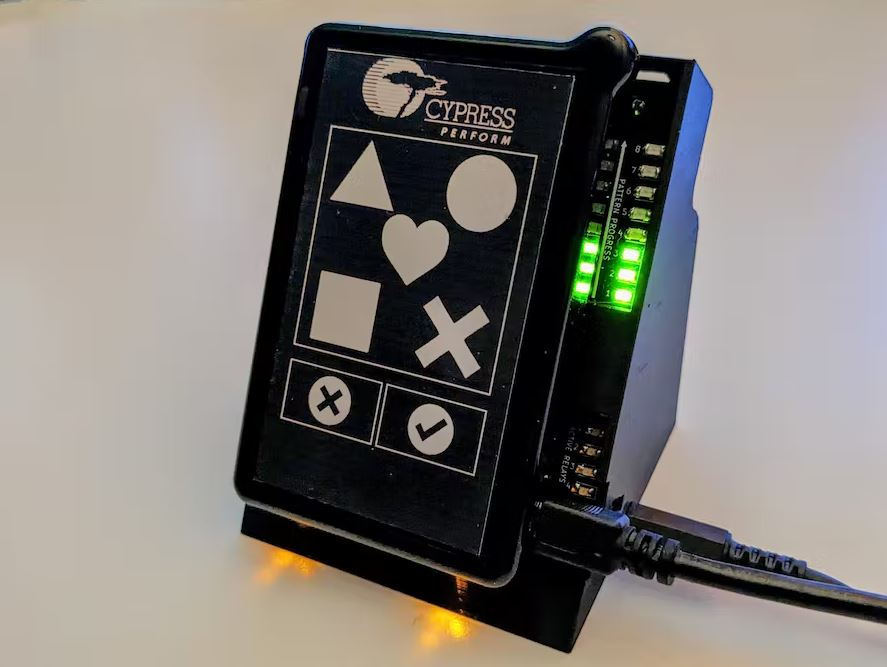

#  Capacitive Pattern Based Input Lock

Created for [Propel Human-Machine Interactions into the Future
with Infineon](https://www.hackster.io/contests/capsense). For the detailed description of the project see [Capacitive Pattern Based Input Lock on Hackster.io](https://www.hackster.io/Tai-Min/capacitive-pattern-based-input-lock-50ced4)

## Folder structure
* case - Simple stand made in FreeCAD (FCStd and STL files)
* code
    * network - Files for gathering dataset, training the network and creating C++ header file for custom inference engine as well as some debug code
    * psoc4100s - Source code for the PSoC 4100S PIONEER KIT
    * scripts - Some code used in Hackster article
* graphics - Custom graphics for front panel of the kit made in GIMP
* shield - KiCad files for custom PCB with relays and diodes

## Instructions
### PCB
Use KiCad's 3D viewer, PCB viewer and bill of materials to assembly the PCB and attach it to the back of the kit via Arduino headers.

### How to run the code
Simply open the project in PSoC Creator 4.0 and upload it to the device.

### How to use custom network model
1. In kit's source code, in helpers.hpp comment out
    * #define INFOS
    * #define WARNS
    * #define DBGS
2. In kit's main.cpp uncomment 
    * //#define SKIP_ADD_PATTERN
    * //#define PRINT_RAW_BUFFER
3. Compile and upload edited code
4. In network/collector.py change label to string of your choice and serial port to kit's port
5. Run collectors.py and collect as many samples of given label as needed. To collect a sample:
    * Draw something on the panel
    * Press accept button
6. Repeat for all needed labels
7. In network/model.py change training constants and model's structure as needed and run the script
8. Replace kit's ssie_model.hpp with content of C++ output of the script 
9. Restore defines in 1. and 2.
10. Compile and upload the code to the device